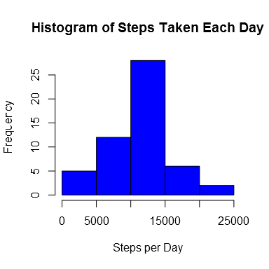
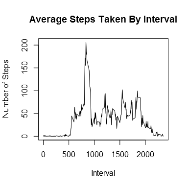
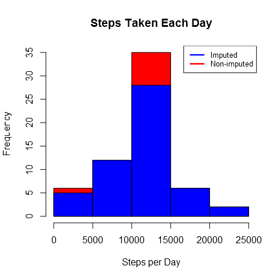
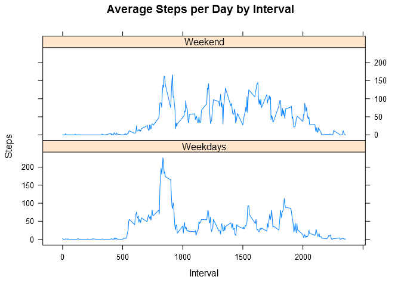

# Reproducible Research: Peer Assessment 1
Paul G. Smith  
2/12/2016  


```r
library(knitr)
library(dplyr)
library(lubridate)
library(ggplot2)
library(lattice)

opts_chunk$set(dev="png", 
               dev.args=list(type="cairo"),
               dpi=96)
```

## Loading and preprocessing the data

Show any code that is needed to

1. Load the data (i.e. read.csv())
2. Process/transform the data (if necessary) into a format suitable for your analysis


```r
# extract the csv file from the zip file and load the data
if(!file.exists("activity.csv")) {
        data <- read.csv(unz("activity.zip", "activity.csv"), header = TRUE,
                         sep = ',', colClasses = c("numeric", "character", "integer"))
        data$date <- ymd(data$date)
}

# tage a look at the sturcture and daa
str(data)
```

```
## 'data.frame':	17568 obs. of  3 variables:
##  $ steps   : num  NA NA NA NA NA NA NA NA NA NA ...
##  $ date    : POSIXct, format: "2012-10-01" "2012-10-01" ...
##  $ interval: int  0 5 10 15 20 25 30 35 40 45 ...
```

```r
head(data)
```

```
##   steps       date interval
## 1    NA 2012-10-01        0
## 2    NA 2012-10-01        5
## 3    NA 2012-10-01       10
## 4    NA 2012-10-01       15
## 5    NA 2012-10-01       20
## 6    NA 2012-10-01       25
```

### What is mean total number of steps taken per day?

1. Calculate the total number of steps taken per day
2. If you do not understand the difference between a histogram and a barplot, research the difference between them. Make a histogram of the total number of steps taken each day
3. Calculate and report the mean and median of the total number of steps taken per day


```r
# aggregate steps by date
steps.by.day <- aggregate (steps~date, data, sum)

# make a histogram of the total number of steps taken each day
hist(steps.by.day$steps, 
     col="blue", 
     main = "Histogram of Steps Taken Each Day",
     xlab = "Steps per Day")
```

\

```r
# Calculate and report the mean and meadian of total steps per day
summary(steps.by.day$steps)
```

```
##    Min. 1st Qu.  Median    Mean 3rd Qu.    Max. 
##      41    8841   10760   10770   13290   21190
```

```r
paste0("The mean number of steps per day is ", 
       round(mean(steps.by.day$steps), digits = 1),
       " and the median is ", round(median(steps.by.day$steps), digits = 1))
```

```
## [1] "The mean number of steps per day is 10766.2 and the median is 10765"
```

### What is the average daily activity pattern?

1. Make a time series plot (i.e. type = "l") of the 5-minute interval (x-axis) and the average number of steps taken, averaged across all days (y-axis).
2. Which 5-minute interval, on average across all the days in the dataset, contains the maximum number of steps?.


```r
# make the time series plot
steps.by.interval <- aggregate(steps ~ interval, data, mean)
plot(steps.by.interval$interval,
     steps.by.interval$steps,
     type = "l",
     main = "Average Steps Taken By Interval",
     xlab = "Interval",
     ylab = "Number of Steps"
)
```

\

```r
# identify the max inteval
paste0("The interval with the most average steps is ", steps.by.interval[which.max(steps.by.interval$steps),1])
```

```
## [1] "The interval with the most average steps is 835"
```

### Imputing missing values

Note that there are a number of days/intervals where there are missing values (coded as NA). The presence of missing days may introduce bias into some calculations or summaries of the data.

1. Calculate and report the total number of missing values in the dataset (i.e. the total number of rows with NAs)
2. Devise a strategy for filling in all of the missing values in the dataset. The strategy does not need to be sophisticated. For example, you could use the mean/median for that day, or the mean for that 5-minute interval, etc.
3. Create a new dataset that is equal to the original dataset but with the missing data filled in.
4. Make a histogram of the total number of steps taken each day and Calculate and report the mean and median total number of steps taken per day. Do these values differ from the estimates from the first part of the assignment? What is the impact of imputing missing data on the estimates of the total daily number of steps?


```r
# Caluculate the number of rows with NAs
incomplete <- sum(!complete.cases(data))

# report it
paste0("There are ", incomplete, " missing values in the dataset")
```

```
## [1] "There are 2304 missing values in the dataset"
```

```r
# fill in the missing values for the data by inserting the average for that interval
data.imputed <- transform(data, steps = ifelse(is.na(data$steps), steps.by.interval$steps[match(data$interval, steps.by.interval$interval)], data$steps))
```
I also noted that there were a large number of zeros on the first day. 


```r
data.imputed[as.character(data.imputed$date) == "2012-10-01", 1] <- 0
```
Now count total steps by day for the imputed data set and create histograms.


```r
# aggregate steps by date for the imputed data
steps.by.day.imputed <- aggregate (steps~date, data.imputed, sum)

# make a histogram of the total number of steps taken each day
hist(steps.by.day.imputed$steps, 
     col="red", 
     main = "Steps Taken Each Day",
     xlab = "Steps per Day")

# make a histogram for the non imputed data and place it on top
hist(steps.by.day$steps, 
     col="blue", 
     main = "Steps Taken Each Day",
     xlab = "Steps per Day",
     add = TRUE)

# add a legend
legend("topright", c("Imputed", "Non-imputed"), 
       lty=c(1,1),
       lwd=c(2.5,2.5),
       cex=0.8,
       col=c("blue", "red"))
```

\

```r
# Calculate and report the mean and meadian of total steps per day
summary(steps.by.day.imputed$steps)
```

```
##    Min. 1st Qu.  Median    Mean 3rd Qu.    Max. 
##       0    8918   10770   10590   12810   21190
```

```r
summary(steps.by.day$steps)
```

```
##    Min. 1st Qu.  Median    Mean 3rd Qu.    Max. 
##      41    8841   10760   10770   13290   21190
```

```r
# report the means and standard deviations for both dataset. 
# Only the median is different (imputed data is slightly higher)
cat("In the imputed dataset the mean number of steps per day is ", 
       round(mean(steps.by.day.imputed$steps), digits = 1),
       " and the median is ", round(median(steps.by.day.imputed$steps), digits = 1),
       "\nIn the original dataset the mean number of steps per day is ", 
       round(mean(steps.by.day$steps), digits = 1),
       " and the median is ", round(median(steps.by.day$steps), digits = 1),
       "\nThe median is slightly higher in the imputed data"
)
```

```
## In the imputed dataset the mean number of steps per day is  10589.7  and the median is  10766.2 
## In the original dataset the mean number of steps per day is  10766.2  and the median is  10765 
## The median is slightly higher in the imputed data
```
### Are there differences in activity patterns between weekdays and weekends?

For this part the weekdays() function may be of some help here. Use the dataset with the filled-in missing values for this part.

1. Create a new factor variable in the dataset with two levels – “weekday” and “weekend” indicating whether a given date is a weekday or weekend day.
2. Make a panel plot containing a time series plot (i.e. type = "l") of the 5-minute interval (x-axis) and the average number of steps taken, averaged across all weekday days or weekend days (y-axis). See the README file in the GitHub repository to see an example of what this plot should look like using simulated data.


```r
# define DoW for weekdays
weekdays <- c("Monday", "Tuesday", "Wednesday", "Thursday", "Friday")

# create a factor variable called dow with 2-levels for weekdays and weekends
data.imputed$dow = as.factor(ifelse(is.element(weekdays(as.Date(data.imputed$date)), 
                                               weekdays), "Weekdays", "Weekend"))

# compute average number of steps taken for each interval
steps.by.interval.int <- aggregate(steps ~ interval + dow, data.imputed, mean)

# time series plot steps by interval for weekend and weekdays
xyplot(steps.by.interval.int$steps ~ steps.by.interval.int$interval|steps.by.interval.int$dow, 
       main="Average Steps per Day by Interval",
       xlab="Interval", 
       ylab="Steps",
       layout=c(1,2), 
       type="l")
```

\
These plots show:

- on weekends there are higher levels of activity throughout the day
- on weekdays the peak level of activity occurs much earlier in the day
